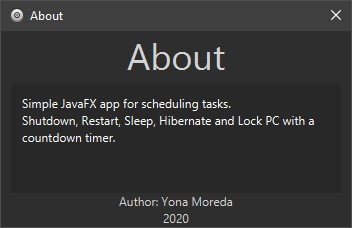

# java-shutdown-scheduler
Small simple javafx app to Shutdown, Lock, Sleep, Restart, Hibernate PC with a countdown.

In order to use sleep and hibernate properly, please turn hibernation off.
```
powercfg -hibernate off
```



